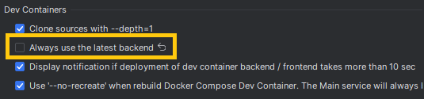
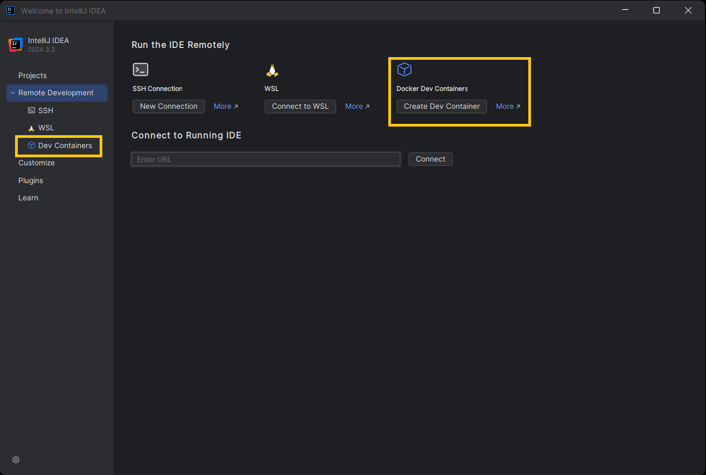
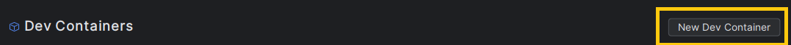
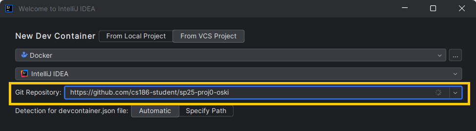
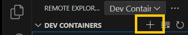

# Configuration in a Development Container

A [development container](https://containers.dev/) is a [quasi-standard](https://github.com/devcontainers/spec) way to configure a development environment in a Docker container and install an agent that communicates with the IDE running on the host machine. The container can run locally or on a remote host.

This provides less isolation than a VM, but is an option for students who are having difficulty configuring their local environment and/or need to build on a remote host.

# Install Docker

[Docker](https://www.docker.com/) must be installed on the machine running the build container. This is almost always the host machine, but it is possible to run the container elsewhere.

# IDE integration

## Intellij IDEA Ultimate

### After Install

As of this writing, Intellij is configured to use the [EAP](https://www.jetbrains.com/idea/nextversion/) (early access) version of its IDE to connect to the container by default. The EAP version is the beta version of the IDE that is not only less stable, its license also expires after 30-45 days. To disable this, go to `Settings > Advanced Settings` and uncheck the box "Always use the latest backend."

This is detailed in the knowledge base article [here](https://youtrack.jetbrains.com/articles/SUPPORT-A-551).

As of this writing, development containers are only supported in the [Ultimate edition](https://www.jetbrains.com/idea/) of Intellij IDEA. Students can obtain a free, non-commercial license [here](https://www.jetbrains.com/community/education/#students) using their university address.

### Creating the Dev Container

Start the IDE and navigate to "Dev Containers":

Create a "New Dev Container":

Use the address of the rookiedb repository for the relevant project, as described in the [setup documentation](https://cs186.gitbook.io/project/assignments/proj0/getting-started#fetching-the-released-code). For example, a student with github username of `oski` working on Project 0 would use the repository address `https://github.com/cs186-student/sp25-proj0-oski`:

Click "Build container" and wait Docker to download and build the image.

## Visual Studio Code (local)

Select  and click the  to create a new dev container.

Select `Clone Repository in Container Volume` and follow prompts to clone the repository into the container.

## Codespaces (VScode/web browser)

A [GitHub Codespace](https://github.com/features/codespaces) runs the build container in Azure; the host can run vscode in a browser or through vscode.

Either open vscode or open the web-based editor for the repository ([example](https://github.dev/berkeley-cs186/sp25-rookiedb)) by navigating through `github.dev` insteaed of `github.com`.

Select  and "Create Codespace".

Please consult the documentation for pricing. As of this writing, GitHub provides 120 core-hours (60 hours in the least-capable image) per month to all users for free. If you elect to run in this or another remote configuration, the TAs cannot help you debug it.
